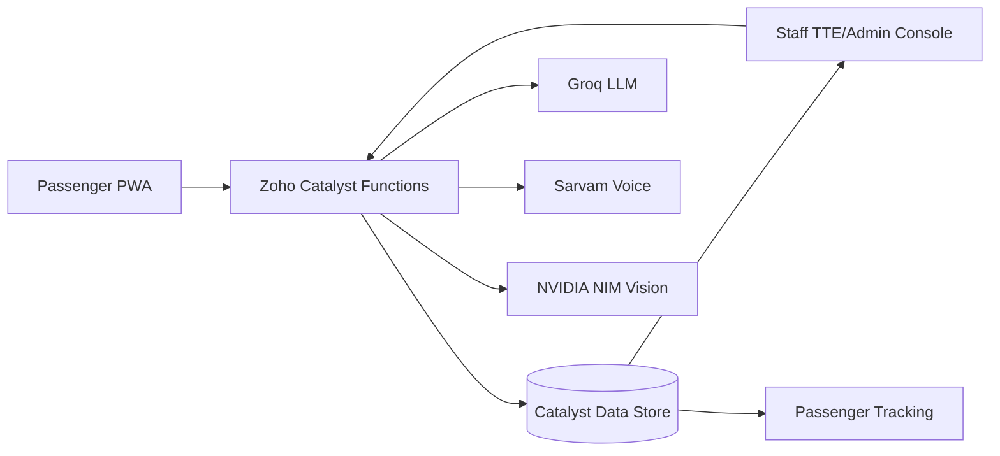

# RailSense AI

RailSense AI is a Zoho Catalyst powered Rail Madad enhancement for SIH 2026. It gives passengers a fast PWA complaint flow and gives TTE/admin staff a real-time operations console with evidence, AI summaries, action plans, and live status updates.

## Live Apps

- Passenger PWA: [railsense passenger](https://railsense-60074625517.development.catalystserverless.in/app/index.html)
- Staff console: [railsense staff](https://railsense-60074625517.development.catalystserverless.in/app/staff/index.html)
- Team walkthrough: [docs/TEAM_WALKTHROUGH.md](docs/TEAM_WALKTHROUGH.md)

## What Works

- Passenger complaint submission with text, voice, ticket photo, uploaded PNG/JPG evidence, and ticket PDF/image extraction.
- PNR, train number, coach, berth/seat, route, and passenger context extraction from ticket media where readable.
- Passenger tracking by complaint ID, including records where Catalyst row data stores the ID inside the payload.
- Staff TTE/admin queue with latest complaints first, real-time refresh, evidence photo rendering, and no blank side panel after close.
- Staff actions for verify, resolve, escalate, add note, assign, and AI guided next steps.
- Provider-backed AI services using Groq, Sarvam, and NVIDIA NIM through server-side Catalyst functions.
- Installable PWA shell for the passenger app.

## Architecture



## Apps

The passenger app lives in `passenger-app/` and builds into `catalyst-client/`. It is optimized for mobile use, handles microphone state visibly, supports camera/upload flows, and keeps the user on a recoverable screen even when a backend provider fails.

The staff app lives in `staff-admin-app/` and builds into `catalyst-client/staff/`. TTE and admin roles share the same real-time incident source, but the interface adapts actions and priority views to the current role.

## Backend

Catalyst functions live in `functions/`:

- `submitComplaint` creates the complaint and stores structured payload/evidence.
- `trackComplaint` finds complaints by row ID or payload complaint ID.
- `staffApi` powers queues, evidence, AI action plans, and staff actions.
- `extractPnrFromImage` reads ticket images/PDF-derived images.
- `tts` and related helper functions connect voice services.

Sensitive provider keys are expected only in Zoho Catalyst function environment variables:

- `GROQ_API_KEY`
- `SARVAM_API_KEY`
- `NVIDIA_NIM_API_KEY`

Do not commit real keys. Use `.env.example` only as a template.

## Local Development

```bash
npm install
cd passenger-app && npm install && npm run build
cd ../staff-admin-app && npm install && npm run build
```

Deploy target files are copied into `catalyst-client/` and deployed with Catalyst:

```bash
catalyst deploy --only client --project 43505000000424037
catalyst deploy --only functions --project 43505000000424037
```

When refreshing Catalyst function env values, use `tools/restore-catalyst-function-env.ps1` with process environment variables set. The script deploys function env values and then removes local secret material from generated config files.

## Verification Snapshot

Latest live verification covered:

- Passenger submit returned a real complaint ID.
- Passenger tracking found that complaint ID.
- Staff queue received the new complaint with passenger photo evidence attached.
- Admin escalation action completed successfully through `staffApi`.
- Staff client HTML is serving the latest deployed bundle.

